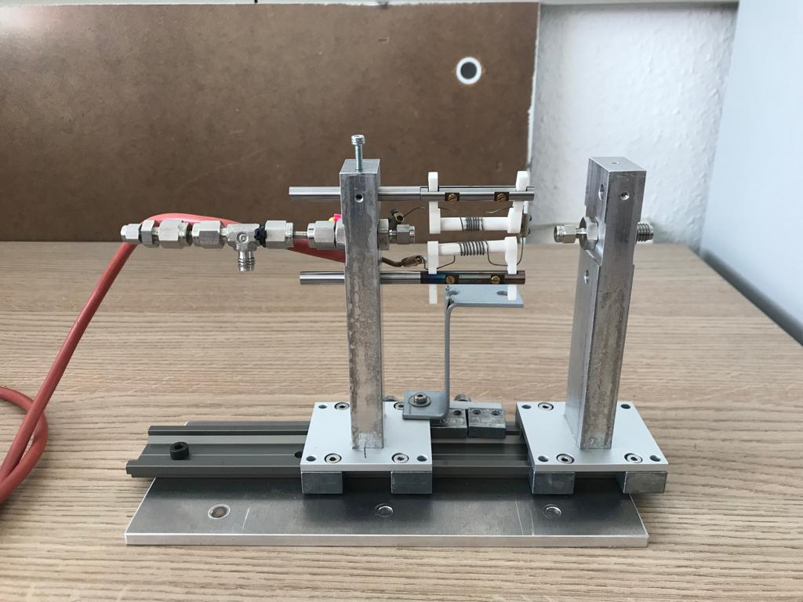
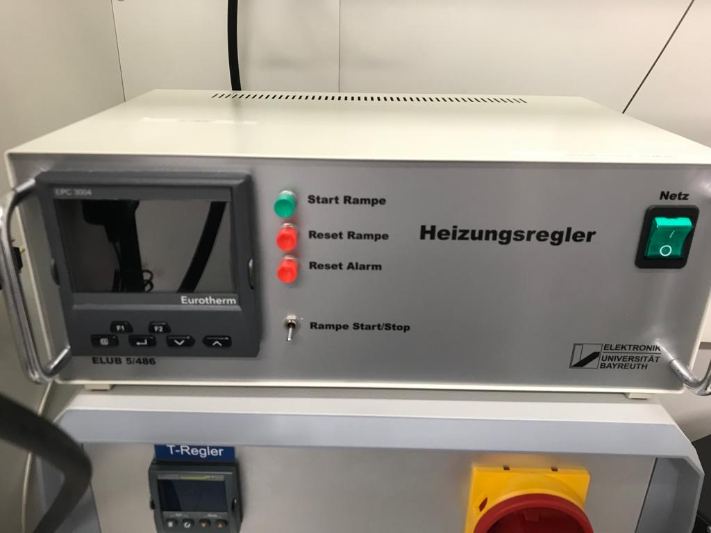
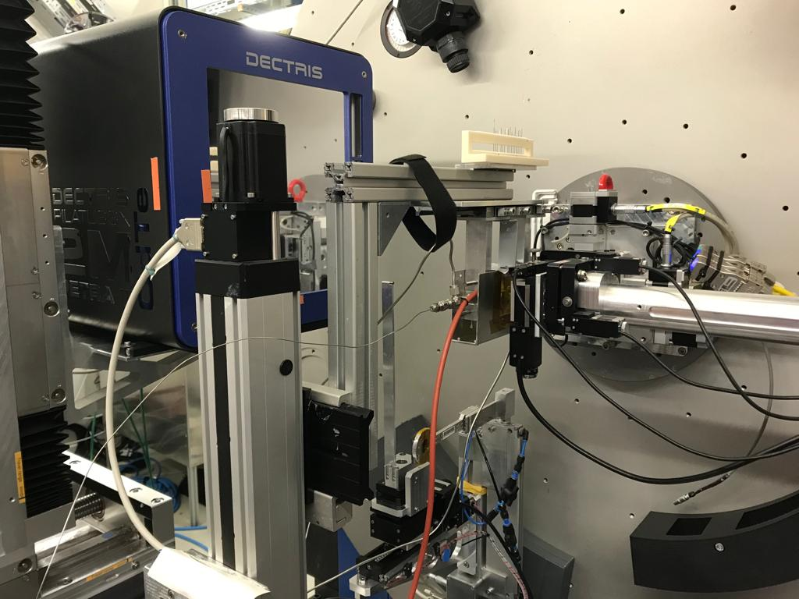

## Step by Step description of the experiment
- A flow cell will be heated by heating coils (see Fig. 1), remotely controlled via an Eurotherm EPC3004 controller. Temperatures of up to 600 °C will be reached. H2, He and CO2 as gases will be used. 

    
    
<em>Figure 1: New gas flow cell</em>

    
    
<em>Figure 2: Eurotherme controller</em>

--- 
### To guarantee gas tightness the following safety concept exists. 
- For all gas connections, gas-tight Swagelok and Hy-Lok fittings are used, as well as metal pipes. The dosing system of the gas mixture consists of three Bronkhorst 200-CV-002-RGD-33-V mass flow controller (will probably be replaced by newer models of the same company), which are monitored and controlled via a FLOW BUS system on a PC. A maximum gas flow of 20 mL/min will be used under a pressure of 1 atm. A temperature resistant quartz capillary as a sample container will be used. Capillaries will come prepared with the catalyst held by quartz wool plugs. This capillary is connected with gas-tight Swagelok fittings and graphene ferrules. The whole setup will be screwed on the sample stage.
- The same setup was just used at a beamtime at DESY and can be seen in Figure 3. 

    
    
<em>Figure 3: Comparable experimental setup at DESY</em>

---
- Prior to the experiment, the flow cell will be purged with helium for approximately 10 minutes. This will be controlled with a gas sensor, gas flow meter and mass spectrometer. When the flow cell is gas tight, dosing with hydrogen can be started and another leak test with H2 sensor is done. After this, the flow cell will be covered with a heatshield, for stabilizing the temperatures around the sample, while preventing anyone from touching the wire. The exhaust gas will end in an exhaust pipe in safe distance to the heating coils.
