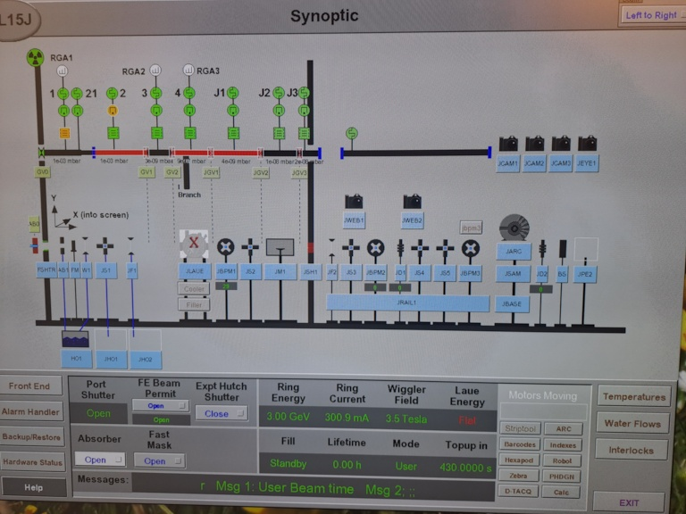

## summation of missed beamtime due to mono problems ##
07.07.
- no setup until 14 o'clock
- no measurement started before 22 o'clock
- mono problems in the night  

08.07.:
- 08:30 mono went off when first catalytic cycle started; took 2 hours to solve problem
- however by this, the in-situ experiment had to be aborted
- 17:30: the MFCs are all not properly calibrated. All flows are only about one third of the specification in mL/min on the control and display panels. The reduction and catalysis from the first night is useless because of bad flows.

# start of day shift at 7:30 #

## continuation of catalysis of La0.5Ce1.5NiO4 sample from night ##
thermocouple was somewhat away from sample; hence, T(sample) > T(thermocouple) by ca. 100 °C during calcination  
  --> thermocouple needs to be set to an estimated 250 °C for cooling down to have 350 °C 
  --> reprogrammed by Benjamin and Felix, because we already started cooling; then maximum power for 5 s before drop to 250 °C  

**7:42** data collection started for **cooling down "Cool down to catalysis" #55379**  
T equilibrated in thermocouple at 250 °C 
data collection aborted at 8:20 

> technician came in at 7:52 to refill cryo to 70 %

**8:21 catalysis started **#55380** with frame time 30 s, potential run time of 3*60*2 = 3 h and gas ratio of 0.5 mL He, 16 mL H2, 4 mL CO2
intensity is gone, f was set to 100 % 
when looking at PCA1, this component decreases strongly; the intensity in the colour plot of the highest peak also decreases --> correlates likely with mono failur  
abort 8.32 last frame 23  

catalysis still running

**8:39** exposure #55381 with 13 frames, no intensity --> Phil contacted 
distance between vales below "RGA3" was red, Phil phoned then it went black again 
individual exosure #55382 with one frame with no intensity 
optics tube between GV2 and JGV1 went red again, then also the tube between JGV1 and JGV2 

    
    
<em>Figure 1: Screenshot of Synoptic overview</em>

**8:57** Phil phoned that mono went off, catalysis was stopped and hence was running for ca. 35 min

> #! several powder rings are burnt into the detector --> adjust measurement strategy to have some sleep time for longer runs

**10:07** Phil phoned back  
List of utilities --> Beamlines --> BL15J Pair Distribution Function --> Synoptic-BL15J -->JLaue Cooler Button --> CryoOC Schematic Screen: If "Run" is not red, then call Phil immediately.

questions to Phil: way to take dark picture or sleep every 20 min? Answer: do not take regular darks despite afterglow, because the ~ 50 cts afterglow is not dramatic compared to 20,000 cts

**10:14 catalysis experiment restarted with #55383**   
Nota: the catalyst was at T = 350 °C for the waiting time of 2 h, but only 
 
the **peaks for NiO are at 2.5 and 4.5 A-1** disappear upon reduction;  
during the mono repair, we flushed He through the capillary, but there seemed to be some oxidation happening, because the peaks of NiO have reappeared; with the start of catalysis conditions (CO2, H2), the NiO peaks disappeared again.  
Because the catalyst had seen completely undefined conditions (not exact T, re-oxidation), the experiment was aborted at 10:40.

MS File wurde als La0.5Ce1.5NiO4.csv gespeichert

# Ag-Hbea calcination and reduction #

we realized that in the lab PDF data, there is a peak doublet in the range 0.3 - 0.5 A-1, which we will not see at Diamond because of the Qmin of ~ 0.6 A-1

**mounting of Ag-H-bea**
MS showed constantly huge N2 and O2 signal although 50 mL/min He were purged and capillary seemed tight; restart of MS software and then the scan took very long (several seconds to a minute) while it was done within few seconds yesterday.
Since we could however detect no leak, we decided to start calcination.

**12:08 calcination of Ag-H-bea**
- programmed for 4 h, but aimed for 3 h of calcination; 10 mL/min of air, heat ramp programmed
- #55384: 30 s frames, "calc_AgHbea", started at ~ 12:09
- heat ramp started thereafter manually, ca. 12:10
- maximum counts were ~ 270 cts and filter was set to 1 %
- #55385: 
- manual overwrite of filter to f(10) and restart of data collection with collect_pe2(f2=10): #55387 intensity 
- 12:32: start of measurement **#55388**, but 60 s exposures because of only 2700 cts/image
- heat ramp started 12:33
- because intensity with f(1) was only 260 cts, we chose to measure with f2=10
- when measurement started we were at ~ 60 °C: #55388  with ca. 2600 cts maximum
- Ag-Hbea decomposed strongly at ~ frame 35, very faint Ag peaks emerged, and at ~ scan 135 Ag peaks emerges

**Ag peaks at 2.7, 3.1, 4.3, 5.1, 5.3 A-1**

**14:44 flushing of Ag-Hbea with He 20 mL/min, start in frame 254**  
- aborted in frame 286
- heat ramp was programmed to constant 450 °C (set to 400 °C on controller because of T offset due to thermocouple position)

**14:58 reduction of Ag-Hbea** 
- with 20 mL/min H2 **#55389**
- nothing happens besides an increase in intensity of the Ag peak at 2.7 A-1 which is about finished according to PCA analysis by ~ frame 40
- in frame 108, change of H2 flow to 40 mL/min
**16:04** abortion of reduction as no further change occured with last frame 124

# empty capillary #
yesterday after optimization of beamstop position and collimator optimization, no empty capillary was collected with final setup.  
- #55390 with 6 frames each 30 s and f2=1: there are now strong dips in the empty cap data because the burnt in peaks are now subtracted. They match the high peaks from the data file #55379, see picture.

PICTURE here

- new dark collected 16:40
- #55391 with 6 frames each 30 s and f2=1: the dips are almost gone - one dip at 2.9 and 3.6 A-1 remains, but does not seem to stem from #55379
- #55392 with 6 frames each 30 s and f2=10
 
# checking of MS flow rates #
We checked how much mL/min our flow meter detects at the inlet of the flow cell in relation to the mL/min specification in the Microreactor control software.
> **! all flows were off! you need to adjust about the triple of what you aim for**

# Hbea reduction #
since no changes should occur during calcination, a very fast heating to 450 °C will be watched followed by reduction
- **17:25** measurement started **#55393**, 30 s frames, f2=10
-heating ramp started 17:25, 20 mL/min H2, i.e. 60 mL/min on microreactor --> now also in the MS the H2 detection is significant, but we could still not clarify where the strong N2-O2 signals come from
- ramp to 450 °C took ~ 22 min; after 35 min no change at all has occurred.
- abortion in frame 78

# Cu-Hbea calcination and reduction #
- air flow of 10 mL/min (on microreactor) to be consistent with calcination of Ag-Hbea (although we know this is only about ~3.3 mL/min)
- #55394: test image with 30 sec, f2=10, "testshot_CuHbea_withf10"
- #55395: test image with 30 sec, "testshot_CuHbea_withoutfixedf2"
- **#55396**: **18:30**: data collection with 30 sec frames, "calcination_CuHbea", start 18:30, heat ramp 5 K/min up to 450 °C (takes 90 min) started during frame 2
- 

  
